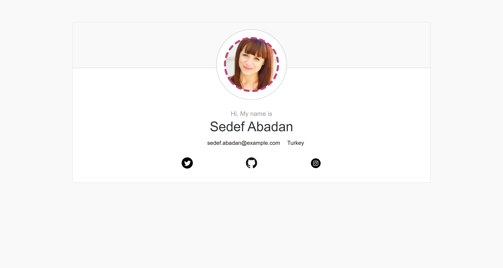

# Getting started with Webpack

This project was built using JavaScript vanilla with components, and use webpack for build the dist folder for production, each time that you refresh the site, you will get different data.

## Table of contents

- [Overview](#overview)
  - [The project](#the-project)
  - [Screenshot](#screenshot)
  - [Links](#links)
- [My process](#my-process)
  - [Built with](#built-with)
  - [What I learned](#what-i-learned)
  - [Useful resources](#useful-resources)
- [Author](#author)

## Overview

### The project

Users should be able to:

- See a card with different data each time that the page is refreshed

### Screenshot

### Links

- Solution URL: [Solution URL here](https://github.com/ncondes/getting-started-with-webpack)
- Live Site URL: [Live site URL here](https://wonderful-heyrovsky-876d95.netlify.app/)

## My process

### Built with

- Semantic HTML5 markup
- CSS custom properties
- Flexbox
- CSS Grid
- Mobile-first workflow
- JavaScript
- Webpack

### What I learned and put into practice

- Set up the enviroment of a project using Webpack

### Useful resources

- [Webpack](https://webpack.js.org/concepts/) - Webpack Documentation.

## Author

- Website - [Nicolas Conde Salazar](https://www.ncondes.com)
- Linkedin - [Nicolas Conde Salazar](https://www.linkedin.com/in/ncondes/)
